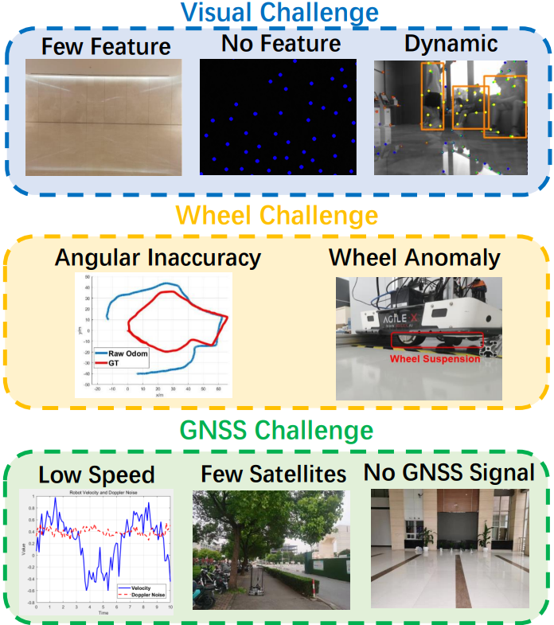

# Ground-Fusion: A Low-cost Ground SLAM System Robust to Corner Cases (ICRA2024)
## Project Author: [Jie Yin](https://github.com/sjtuyinjie?tab=repositories) at (1195391308@qq.com)

## news

2024.3.26 I have already release the Ground-fusion codes (Ubuntu 18.04 version).

2024.3.25 I have already release the Ground-fusion codes (Ubuntu 20.04 version).

2024.1.29 Accepted by ICRA2024. I have already released the datasets, and will release the code soon.

   

## Introduction

We introduce Ground-Fusion, a low-cost sensor fusion simultaneous localization and mapping (SLAM) system for ground vehicles. Our system features efficient initialization, effective sensor anomaly detection and handling, real-time dense color mapping, and robust localization in diverse environments. We tightly integrate RGB-D images, inertial measurements, wheel odometer and GNSS signals within a factor graph to achieve accurate and reliable localization both indoors and outdoors. To ensure successful initialization, we propose an efficient strategy that comprises three different methods: stationary, visual, and dynamic, tailored to handle diverse cases. Furthermore, we develop mechanisms to detect sensor anomalies and degradation, handling them adeptly to maintain system accuracy. 

The preprint version of paper is [arxiv](http://arxiv.org/abs/2402.14308).
The dataset is at [https://github.com/SJTU-ViSYS/M2DGR-plus](https://github.com/SJTU-ViSYS/M2DGR-plus) and [https://github.com/SJTU-ViSYS/M2DGR](https://github.com/SJTU-ViSYS/M2DGR).

Figure 1. We categorize corner cases into three types: visual,
wheel, and GNSS challenges.

## 1. Prerequisites and Installation
### 1.1 Ubuntu and ROS
Tested on Ubuntu 18.04 (with ROS Melodic and OpenCV3) and on Ubuntu 20.04(with ROS Noetic and OpenCV4).

### 1.2 OpenCV
This package requires [OpenCV 3/4](https://github.com/opencv/opencv) and some features of C++11. 

### 1.3 Eigen, Ceres, and PCL
This package requires [Eigen 3.3.7](https://github.com/PX4/eigen), [Ceres 1.14](https://ceres-solver.googlesource.com/ceres-solver),[Sophus](https://github.com/strasdat/Sophus.git ) and [PCL 1.10 or 1.11](https://github.com/PointCloudLibrary/pcl).
You need to download they in your thirdparty folder, and then:
~~~
sudo apt-get update
sudo apt-get install -y cmake libgoogle-glog-dev libgflags-dev libatlas-base-dev libsuitesparse-dev 
cd thirdparty/eigen
mkdir -p build && cd build
cmake ..
sudo make install
cd ../../ceres-solver
mkdir -p build && cd build
cmake ..
make -j$(nproc) 
sudo make install
sudo apt-get install -y libflann-dev libvtk6-dev libboost-all-dev ros-noetic-pcl-ros (for ubuntu20.04) libfmt-dev
cd ../../pcl
mkdir -p build && cd build
cmake ..
make -j$(nproc)
sudo make install
cd ../../Sophus
mkdir -p build && cd build
cmake ..
make -j$(nproc) 
sudo make install
~~~

### 1.4 Gnss_comm
This package also requires [gnss_comm](https://github.com/HKUST-Aerial-Robotics/gnss_comm) for ROS message definitions and some utility functions.

### 1.5 Configure gcc (For Ubuntu 20.04)
~~~
sudo apt-get install g++-8
sudo apt-get install gcc-8
sudo update-alternatives --install /usr/bin/gcc gcc /usr/bin/gcc-8 20
sudo update-alternatives --install /usr/bin/g++ g++ /usr/bin/g++-8 20
~~~

### 1.6 Build Ground-Fusion
After install all 3rd parties：
~~~
mkdir -p ~/Groundfusion_ws/src
cd ~/Groundfusion_ws/src
git clone https://github.com/HKUST-Aerial-Robotics/gnss_comm
git clone https://github.com/SJTU-ViSYS/Ground-Fusion
cd ../..
catkin_make -j12
~~~

## 2. Run examples

### 2.1 Ground-challenge dataset
Download at [Ground-challenge](https://github.com/sjtuyinjie/Ground-Challenge) and give a star.

~~~
# [launch] open a terminal and type:
source devel/setup.bash
roslaunch vins groundfusion.launch

# [run localization] open another terminal:
source devel/setup.bash
rosrun vins vins_node src/Ground-Fusion/config/realsense/groundchallenge.yaml

# [dense map]open third terminal:
source devel/setup.bash
rosrun dense_map dense_map_node src/Ground-Fusion/config/realsense/groundchallenge.yaml
~~~

### 2.2 M2DGR-P dataset
Download at [M2DGR-P](https://github.com/sjtuyinjie/M2DGR-plus) and give a star.

~~~
# [launch] open a terminal and type:
source devel/setup.bash
roslaunch vins groundfusion.launch

# [run localization] open another terminal:
source devel/setup.bash
rosrun vins vins_node src/Ground-Fusion/config/realsense/m2dgrp.yaml

# [dense map]open third terminal:
source devel/setup.bash
rosrun dense_map dense_map_node src/Ground-Fusion/config/realsense/m2dgrp.yaml
~~~

## 3. Acknowledgement
Thanks support from National Key R&D Program (2022YFB3903802), NSFC(62073214), and Midea Group. This project is based on [GVINS](https://github.com/HKUST-Aerial-Robotics/GVINS), and has borrowed some codes from open-source projects [VIW-Fusion](https://github.com/TouchDeeper/VIW-Fusion) and [VINS-RGBD](https://github.com/STAR-Center/VINS-RGBD), thanks for your great contribution!

## 4. License
The source code of Ground-Fusion is released under GPLv3 license. Do not use this project for any commercial purpose unless permitted by authors. Yin Jie is still working on improving the system. For any technical issues, please contact him at <1195391308@qq.com>.

If you use this work in an academic work, please cite:
~~~
@article{yin2021m2dgr,
  title={M2dgr: A multi-sensor and multi-scenario slam dataset for ground robots},
  author={Yin, Jie and Li, Ang and Li, Tao and Yu, Wenxian and Zou, Danping},
  journal={IEEE Robotics and Automation Letters},
  volume={7},
  number={2},
  pages={2266--2273},
  year={2021},
  publisher={IEEE}
}
@article{yin2024ground,
  title={Ground-Fusion: A Low-cost Ground SLAM System Robust to Corner Cases},
  author={Yin, Jie and Li, Ang and Xi, Wei and Yu, Wenxian and Zou, Danping},
  journal={arXiv preprint arXiv:2402.14308},
  year={2024}
}
~~~

